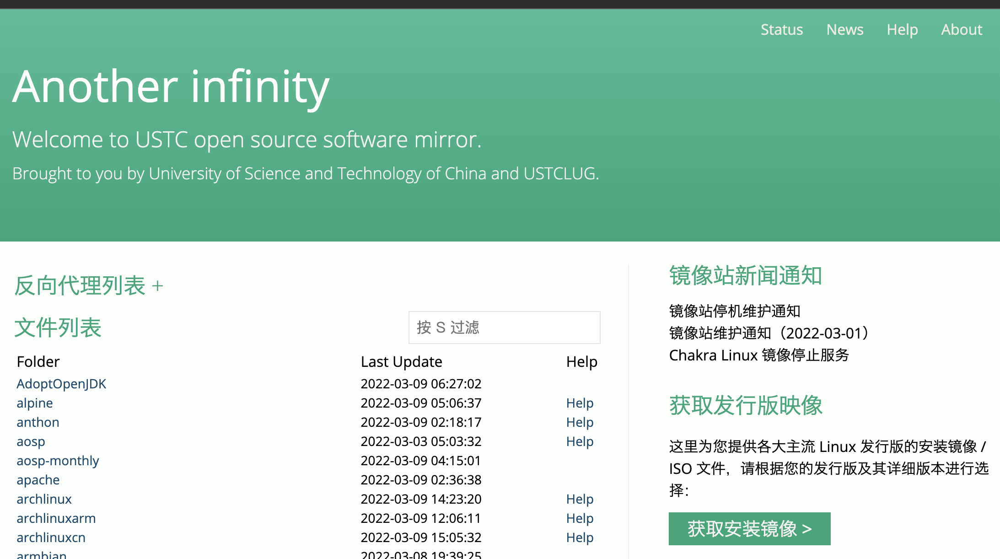
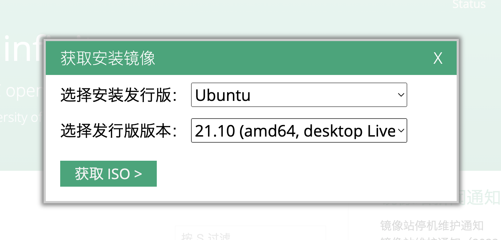

## Linux 概述

> **Linux**是一种[自由和开放源码](https://zh.wikipedia.org/wiki/自由及开放源代码软件)的[类UNIX](https://zh.wikipedia.org/wiki/类Unix系统)[操作系统](https://zh.wikipedia.org/wiki/作業系統)。该操作系统的[内核](https://zh.wikipedia.org/wiki/内核)由[林纳斯·托瓦兹](https://zh.wikipedia.org/wiki/林纳斯·托瓦兹)在1991年10月5日首次发布[[5\]](https://zh.wikipedia.org/wiki/Linux#cite_note-5)[[6\]](https://zh.wikipedia.org/wiki/Linux#cite_note-6)，在加上[用户空间](https://zh.wikipedia.org/wiki/使用者空間)的[应用程序](https://zh.wikipedia.org/wiki/應用程式)之后，成为Linux操作系统。Linux也是[自由软件](https://zh.wikipedia.org/wiki/自由软件)和[开放源代码软件](https://zh.wikipedia.org/wiki/开放源代码软件)发展中最著名的例子。只要遵循[GNU 通用公共许可证](https://zh.wikipedia.org/wiki/GNU通用公共许可证)（GPL），任何个人和机构都可以自由地使用Linux的所有底层[源代码](https://zh.wikipedia.org/wiki/源代码)，也可以自由地修改和再发布。大多数Linux系统还包括像提供[GUI](https://zh.wikipedia.org/wiki/GUI)的[X Window](https://zh.wikipedia.org/wiki/X_Window)之类的程序。除了一部分专家之外，大多数人都是直接使用[Linux 发行版](https://zh.wikipedia.org/wiki/Linux發行版)，而不是自己选择每一样组件或自行设置。
>
> --节选自中文维基

linux是信息安全方向中常用的操作系统，这里希望大家能掌握一些工具的使用。

读者在前面的课程当中应该已经对 linux 系统的使用相当熟悉了，不过这里还是要强调一下：本章节的例题基本都是在 x86 架构的设备上编译运行的，对于其它架构的读者 **（如采用 arm 架构芯片的 mac 用户）** ，可能需要通过 qemu 等方式来完成本章节的学习。

## 系统的下载及安装

一般来说，初学者常用的linux发行版都是ubuntu，自本文写下之日已经发布到了22.10版本。大家可以去[学校的镜像站(https://mirrors.ustc.edu.cn/)](https://mirrors.ustc.edu.cn/)自行下载安装。

右下角选择获取安装镜像。

选择发行版和版本下载。

下载下来的 iso 文件，可以在实机上安装，也可以通过虚拟机安装。这里建议选择后一种方式。常用的虚拟机有开源的 VirtualBox 以及商业的 Vmware 等，在 macos 下可以使用 ParallelsDesktop。这里不详细说明使用方法。

