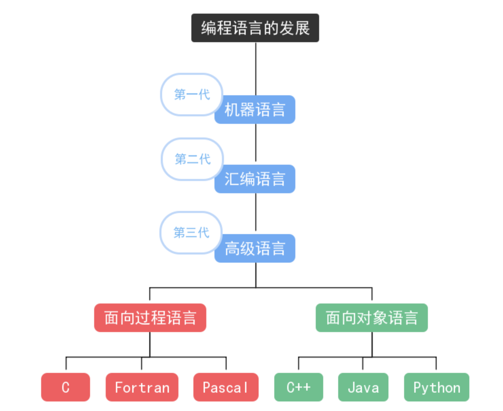
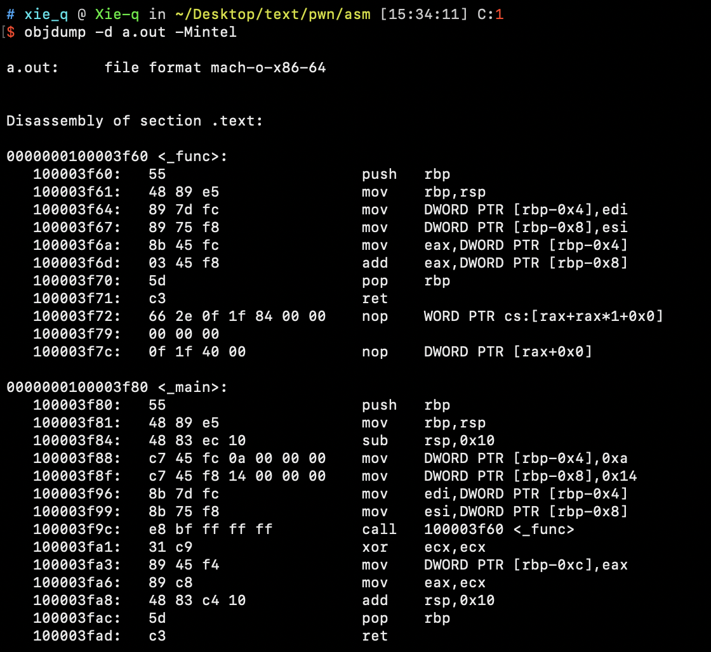
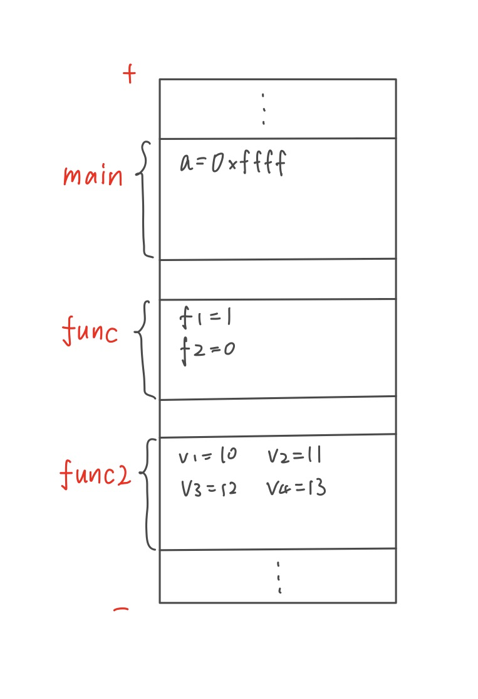
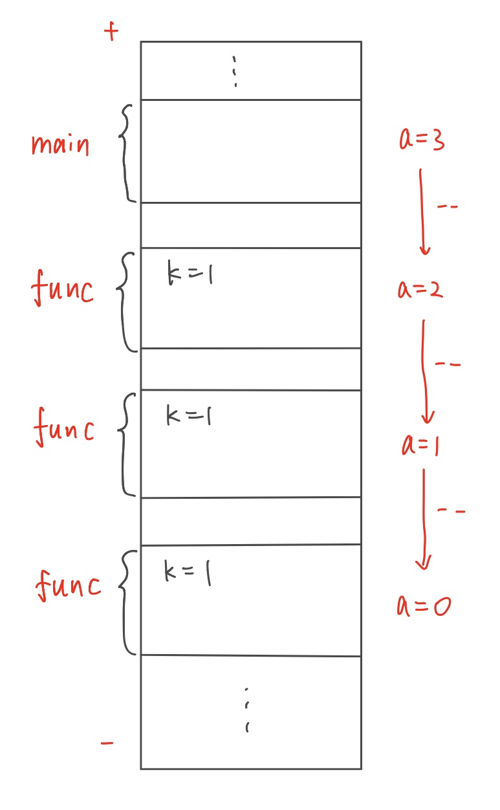
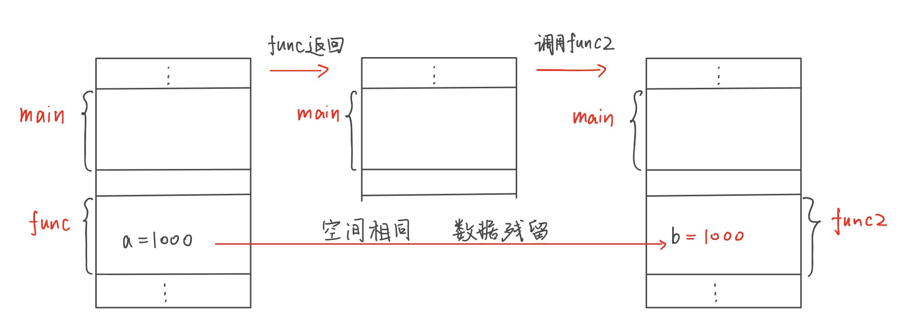
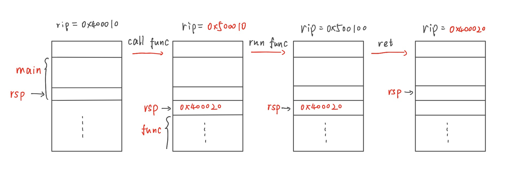
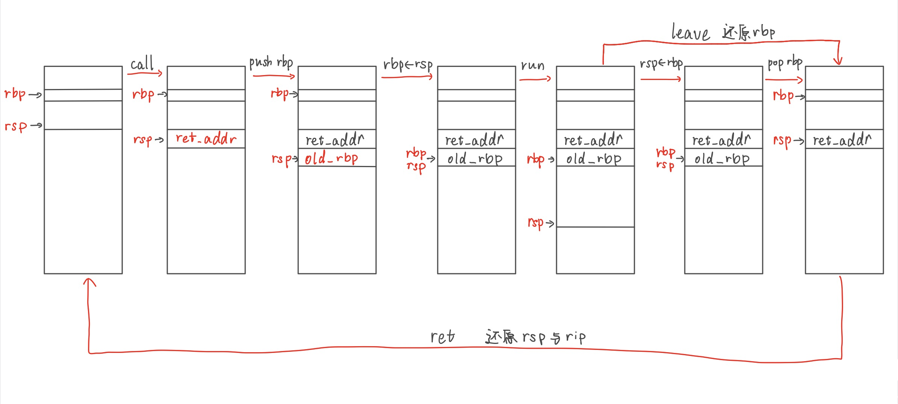
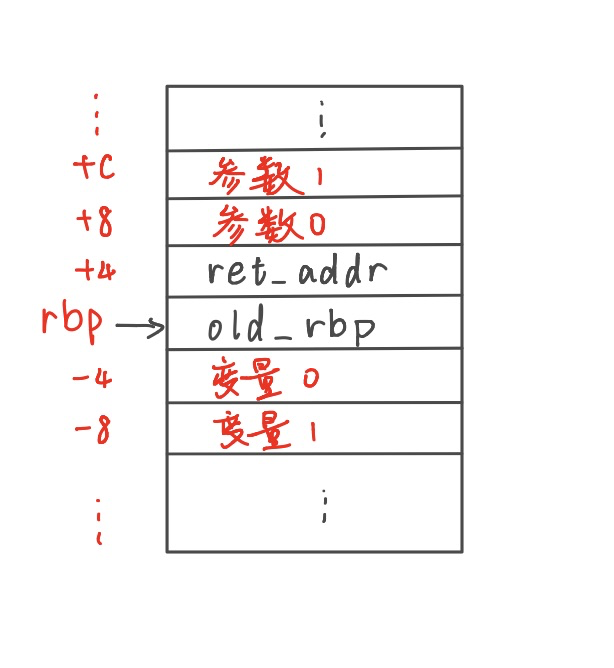

## 汇编语言的特点和发展

众所周知，现代计算机世界是以二进制为基础的。很常见地，我们将各种信息进行采样、数据化后，以二进制的方式存储在各种介质上，交由计算机进行处理。同样地，计算机程序在底层处理的时候，也是通过各种二进制机器码来表示的。计算机中处理的二进制数据按照用途大体上可以分为三类，即数据、地址、指令（并不严格，前两类可以相通）。具体的数据究竟是哪种类型其实并没有定论，完全取决于用户如何去看待这项数据。一个比较有趣的论述是，拍下一张照片，将后缀名改成txt，有可能会变成一篇好文章，也可能变成一个实用的小程序。虽然在现实中这种事件的概率几乎不存在，但是仍然可以体现这一原理。

最吸引我们的是指令。我们在学习C语言的时候了解过，语言的发展大体经历过机器语言、汇编语言、高级语言三个阶段，我们学习的C语言属于高级语言。而机器语言在我们的印象中，和打孔机还有高级黑客能用01电话线重装系统比较相关。



图1.语言发展阶段

我们可以从语言的发展阶段来认识三种语言的关系。最初的机器语言是完全面向底层的操作编程，使用机器码，通过译码器等装置转化成计算机的各种基础操作、比如寄存器运算、内存存取等等。

由于机器码过于缺乏可读性，因此诞生了汇编语言，事实上就是给数字进制表示的机器码替换成了一些英文字母来进行表示，以此来增加指令的可读性。因此，**机器码和汇编语言只是对计算机指令的两种表达方式，可以认为是一一对应的**，给定一个二进制的程序，只要能查一张有对应关系的表，就能实现这两种语言的转化。

但也正因如此，汇编语言也只能执行机器码的底层操作，像是我们在C语言中认为是最基础的变量定义和赋值、循环和条件判断、函数返回等操作，在汇编语言中都没有最直接的实现，而是只能使用寄存器、手动寻址等等一些比较麻烦的操作，编写大程序的效率比较低下。因此后来又发展出了高级语言，对一些比较符合直觉的操作进行了封装，本质上是对编程的模型进行了一个封装，具体操作是用编译器将高级语言代码用一些固定的模式翻译成汇编指令。有了高级语言后，我们不必太过关心如何分配内存、如何寻找内存地址、如何执行指令跳转等，而是更去关心程序执行的算法。

这也告诉我们，高级语言和汇编语言并不是一一对应的，相同的代码用不同版本的编译器可能生存不同的指令段，而两段相同的汇编指令操作也可能是从不同的高级语言代码编译而来。因此，真正意义上完全还原的反编译，即从编译好的程序得到完全精确的源代码是不可能做到的，我们只能通过一些常用的编译习惯，来推测最合理或者操作完全相同的源代码。

在pwn题的解题中，我们能取得二进制程序，因此可以直接转换得到的就是程序的汇编指令。以linux为例，假设可执行文件叫做test，我们可以通过以下objdump指令来查看汇编指令。默认使用AT&T格式，本套教程使用intel格式，因此添加一些参数。

```shell
objdump -d test -Mintel > test.s
```



图2.执行效果

这样我们就将test程序的汇编代码输出到了test.s中去。

同样地，我们在编译一个C程序的时候，也可以只进行编译这一步，将高级语言代码只编译为汇编代码，具体指令为

```shell
gcc test.c -S -masm=intel -o test.s
```

---

## 汇编语言入门

现在我们有一些非常强大的工具（比如IDApro）可以实现高效、高准确率的反汇编功能，但是在分析漏洞和漏洞利用的过程中，我们还是需要精确到指令的分析手段。在高级语言流行后，人们学习汇编语言的目标一般是能读懂程序就行；但是ctf中的要求可能略高一些，我们需要顾名思义地“会编”。接下来，我们直接从“如何直接编写一个汇编风格的程序”的角度，以常用的x86-64架构来讲解一些简单的汇编语言知识和思想。注意这里说的是汇编风格而不是精确的汇编程序，因为真实的汇编程序所牵涉到的不仅仅是汇编代码的编写，严格定义的指令也比较复杂。

### 基本概念

#### 寄存器

寄存器是计算机能直接进行运算的存储器件。在C语言中，我们通过在变量定义的前面添加register来申请寄存器变量，而不是用内存来存储。寄存器是计算机中读取和运算速度最快的存储器件，但是个数有限，一般分为通用寄存器和一些有特殊用途的专用寄存器。

在64位中，最常见的寄存器有rax、rbx、rbp、rip、rsp等等。其中rax、rbx等常用于执行一些简单的通用运算和数据传递；rbp常用于在函数的运行空间中标注基地址；rip则是指令寄存器，用来指示当前执行的指令是哪一条；rsp则是栈指针，标注当前函数运行空间的顶端。

一般来说，对于通用寄存器，我们可以取出其中的部分进行操作。比如，rax表示该寄存器的64位，eax则表示其低32位，ax表示其低16位，还有ah与al表示低16位中的高低两个字节。这些表示有一部分原因是为了兼容旧版本程序对32位乃至16位运算的支持。

#### 内存

内存的概念与我们在C语言中学习的基本相同。内存是一块比较大的线性区域，用于存储整个程序运行中的数据。在C语言中，我们一般定义一个变量，计算机就会在内存中开辟一块对应大小的区域来进行存放，数组等也类似。和寄存器相对地，内存的可用空间一般比较大，但是存取和运算速度比寄存器慢，而且一般不能直接对内存上的数据进行运算。在汇编语言中，我们的指令代码段是装载到内存中的，通过rip寄存器中的数据找到下一条指令所在的内存地址来进行取指、装载进译码装置中进行指令的操作。

这里需要注意，和最朴素的汇编语言不同，我们如今编写的汇编程序借鉴了一些高级语言的思想，一般不会要求程序员手动规划内存地址，而是通过声明的方式来向计算机进行申请，在存取的时候通过标号和偏移量来进行寻址。

#### 栈

我们在数据结构中学习过栈。栈最重要的特点是后进先出，这个特点和函数的调用执行几乎完美契合。事实上，一般高级语言中函数时在的空间就分布在栈上。在汇编语言或者说二进制程序的运行环境中，栈是一块独立划分出的内存区域，我们用rsp来指出当前的栈顶元素所在的地址。

在x86-64中我们的栈是负增长的，也就是说数据入栈的时候，我们将栈顶减去一个值后将数据存入，而栈顶的地址在数值上是最低的。

#### 堆

堆是程序执行时内存中另外一块特殊的内存区域，常用于动态分配的变量存取。在C语言中我们常用的malloc和free等函数，在底层中就是对堆中内存进行操作。在初学中，我们不需要对堆的操作进行深入了解。

### 基础指令(intel格式)

在汇编语言中，一条指令由操作码和操作数组成。操作码就是我们常说的指令类型，而操作数则表示这条指令操作的对象。对象可能是立即数、内存地址或者是寄存器。

### MOV

mov是最常见的指令，用于移动数据。使用这个指令，我们可以进行寄存器的初始化、数据在寄存器和内存间的移动等操作，从而达到内存数据存取的目的。一般地，mov有两个操作数，第一个表示操作的目标，第二个表示数据的来源。

例1.

``` assembly
mov		rax,10
```

这是mov指令最简单的用法， 表示将10这个立即数写入rax寄存器中。

例2.

```assembly
mov		ecx,0xaaff00
mov		DWORD PTR [rcx],0xa
```

这个例子中的第一句同例1，表示将0xaaff00写入ecx中，第二句则是mov的另外一种用法：间接寻址。方括号表示，读取rcx的数据作为地址，在内存中找到这个地址，写入0xa这个立即数。而前面的DWORD PTR表示这个写入一次是4字节的，也就是将0x0000000a写入rcx中存储的地址开头的四字节中。可以看出这个操作和C语言中的指针操作非常像，事实上，这两句汇编代码来源于下面的C语言代码：

```c
*(int*)0xaaff00=10;
```

我们可以对应地来看：第一个星号表示指针取值，事实上被翻译为了汇编中的方括号；强制转换为int指针则规定了一次操作的位数为4字节，事实上被翻译成了汇编中的DWORD PTR。大家在初学的时候为了避免阅读复杂，可以只关注方括号内的内容。

同样地我们可以依此类推：

``` c
*(char*)0x40aa00=10;
*(short*)0x40bb00=20;
*(int*)0x40cc00=30;
*(long long*)0x40dd00=40;
```

以上代码段被编译为：

```assembly
   100003f86:	b9 00 aa 40 00       	mov    ecx,0x40aa00
   100003f8b:	c6 01 0a             	mov    BYTE PTR [rcx],0xa
   100003f8e:	b9 00 bb 40 00       	mov    ecx,0x40bb00
   100003f93:	66 c7 01 14 00       	mov    WORD PTR [rcx],0x14
   100003f98:	b9 00 cc 40 00       	mov    ecx,0x40cc00
   100003f9d:	c7 01 1e 00 00 00    	mov    DWORD PTR [rcx],0x1e
   100003fa3:	b9 00 dd 40 00       	mov    ecx,0x40dd00
   100003fa8:	48 c7 01 28 00 00 00 	mov    QWORD PTR [rcx],0x28
```

例3.

``` assembly
mov    DWORD PTR [rbp-0x4],0xa
```

这段代码和例2中不同的是方括号中的寄存器减去了4，意义类似，取出rbp中的值，减去4，作为内存地址，在内存中找到后把0xa写入那四字节中。

这样的代码是非常常见的，它来源于下面的C代码。这里的a是一个函数里的局部变量：

``` c
int a=10;
```

这里需要回顾一下之前讲的栈。rbp表示当前函数栈的基地址，事实上a被分配到了基地址以下4字节的位置，所以才会有减去4后间接寻址的操作。

#### SUB、ADD

sub指令也比较直观，其实就是将第一个操作数减去第二个操作数，结果存放在第一个操作数中。

例4.

``` assembly
sub    ecx,0x4
```

上面的指令表示将ecx中的值减去4，结果存放在ecx中。

例5.

```c
    int a=11;
    int b=a-6;
```

函数中，上面的代码被编译成下面的指令。

```assembly
   100003fa6:	c7 45 fc 0b 00 00 00 	mov    DWORD PTR [rbp-0x4],0xb
   100003fad:	8b 4d fc             	mov    ecx,DWORD PTR [rbp-0x4]
   100003fb0:	83 e9 04             	sub    ecx,0x6
   100003fb3:	89 4d f8             	mov    DWORD PTR [rbp-0x8],ecx
```

大家可以画图对照，rbp-4处存放的是a，-8处存放的是b。其中，a-6这一步的运算对应第三行的sub指令。

例6.

可以有更复杂一些的例子。

```c
		int a=11;
    int c=6;
    int b=a-c;
```

也是在函数内部的情况，代码被翻译为：

```assembly
   100003f96:	c7 45 fc 0b 00 00 00 	mov    DWORD PTR [rbp-0x4],0xb
   100003f9d:	c7 45 f8 06 00 00 00 	mov    DWORD PTR [rbp-0x8],0x6
   100003fa4:	8b 4d fc             	mov    ecx,DWORD PTR [rbp-0x4]
   100003fa7:	2b 4d f8             	sub    ecx,DWORD PTR [rbp-0x8]
   100003faa:	89 4d f4             	mov    DWORD PTR [rbp-0xc],ecx
```

其中-4处存放a，-8处存放c，-12处存放b。可以看到，前两行先对内存地址初始值，第三行开始，将内存数据放入寄存器ecx准备运算，第四行进行减法，第五行赋值。

ADD指令和SUB指令完全类似，不深入讲解。

SUB指令还有用于条件判断的功能。这里有另一个概念就是标志寄存器。简单来说，做完减法运算后，可能结果是负数或者溢出等等，当做完一次这样的运算后，这些附带的结果就会改变标志寄存器的值，比如结果等于0标志寄存器的某一位变成1、结果小于0则另一位变成1等等，这些细节我们不必深究。

标志寄存器的用途是，后续的程序可以通过看寄存器相应位的值来判断上一次运算的结果情况，从而达到条件判断的效果。

#### CMP

讲完SUB后，CMP其实就很简单了，CMP相当于只计算，不把结果写入第一个操作数的SUB。因此，CMP指令基本就可以用于判断变量的大小。

#### J系列

J系列指令代表了一系列跳转指令。最简单的是JMP指令，表示无条件跳转。

例7.

```c
int main(){
    int a=3;
label1:
    a++;
    goto label1;
}
```

上面的代码段被编译为下面的指令（只有主体部分）：

```assembly
   100003f9b:	c7 45 f8 00 00 00 00 	mov    DWORD PTR [rbp-0x8],0x3
   100003fa2:	8b 45 f8             	mov    eax,DWORD PTR [rbp-0x8]
   100003fa5:	83 c0 01             	add    eax,0x1
   100003fa8:	89 45 f8             	mov    DWORD PTR [rbp-0x8],eax
   100003fab:	e9 f2 ff ff ff       	jmp    100003fa2 <_main+0x12>
```

最后一行的jmp对应了goto语句。汇编语句最前面的十六进制数表示指令在内存中的地址。回顾之前度rip寄存器的描述，第五行的指令事实上等价于下面的指令：

```assembly
mov		rip,0x100003fa2
```

但是事实上mov指令不能直接更改rip。

其他的J指令多为条件跳转。

* JE - Jump if Equal
* JNE - Jump if Not Equal
* JG - Jump if Greater
* JGE - Jump if Greater or Equal
* JL - Jump if Less
* JLE - Jump if Less or Equal

这些都是比较常见的条件跳转。这些指令前面一般都跟随CMP指令（第一个数比第二个数），J指令通过读取CMP运算之后的标志寄存器的状态来判断是否跳转。

#### LEA

LEA指令相当于MOV指令间接寻址的前半部分。事实上，这个指令更像ADD或者SUB，但是有一些常用的情况。

例8.

```assembly
1.lea		rax,[rbp-0x4]
2.mov		rax,QWORD PTR [rbp-0x4]
```

1相当于将rbp寄存器中的值减去4，直接存入rax；2则更进一步，减去4以后，将结果作为内存地址，在内存中寻址后取值存入rax。因此LEA相当于这种情况下MOV指令的前半部分。

或者说，2等价于：

```assembly
lea		rax,[rbp-0x4]
mov		rax,QWORD PTR [rax]
```

这条指令在C语言中也很容易找到对应。

例9.

```c
    int a=0;
    int *b=&a;
    *b=1;
```

函数中以上的代码被编译成下面的指令，其中a在-4，b在-16。注意b是一个int指针，是64位的，因此由于内存对齐等规则被分配到了-16的位置。

```assembly
   100003f96:	c7 45 fc 00 00 00 00 	mov    DWORD PTR [rbp-0x4],0x0
   100003f9d:	48 8d 4d fc          	lea    rcx,[rbp-0x4]
   100003fa1:	48 89 4d f0          	mov    QWORD PTR [rbp-0x10],rcx
   100003fa5:	48 8b 4d f0          	mov    rcx,QWORD PTR [rbp-0x10]
   100003fa9:	c7 01 01 00 00 00    	mov    DWORD PTR [rcx],0x1
```

可以看出，&a这一运算对应了第二行指令。上面的第三行对应下面的第四第五行，事实上第四行冗余了。

### 函数与栈帧

在前面的章节中，我们学习了一些基础的汇编指令。学习完这些之后我们其实可以写一些比较简单的代码片段了，但是我们还没有学会输入和输出等功能怎么调用。而在这之前，我们首先需要学习如何调用函数。

之前曾经提到过，函数的运行空间在栈上。总体来说，每个函数的运行会有一个栈帧，这个栈帧里保存了函数运行的各种局部变量和临时空间等等。我们可以举下面一个例子来说明。

例10.

```c
void func2(){
	char v1=10,v2=11,v3=12,v4=13;
	printf("hello world!");
}
void func(){
	short f1=1,f2=0;
	func2();
}
int main(){
	int a=0xffff;
	func();
}
```

当上面的代码运行到printf时，我们可以画出三个栈帧，逻辑上如下图。



图3.函数栈帧演示

有趣的是，三个栈帧的空间大小理论上是一样的，因为他们局部变量的空间都是4字节，而且比较平整不会有对齐问题。

我们可以从main函数开始，每调用一个函数，就新开辟一个函数的栈帧，用来保存对应的局部变量的空间，如此一来我们就有了三个栈帧。

例11.

```c
int a=3;
void func(){
	int k=1;
	if(--a) func();
	printf("hello world!%d",a);
}
int main(){
	func();
}
```

上面的例子讲述了一个函数的递归调用。当func调用到第三次时，进入递归出口。栈帧如下，我们可以看到，同一个func开辟了三个栈帧，每个栈帧里面都有一个k=1，但是三个k确实并不是同一样东西。事实上可以这么理解：我们在定义函数的时候事实上定义了一个栈帧的模版（根据你声明的局部变量），只有真正调用这个函数的时候才会按照这个模版开辟栈帧。



图4.递归栈帧

例12.

```c
void func(){
	int a=1000;
  printf("%d",a);
}
void func2(){
	int b;
	printf("%d",b);
}
int main(){
	func();
	func2();
}
```

思考一下两个函数在调用时栈帧的情况。在一般的编译器下，func和func2函数的变量类型声明完全相同（更进一步地，空间排布相同），因此他们的栈帧应该是相同的，但是执行的操作不一样，一个是赋值，另一个则是读取并打印。运行程序，发现输出b的值是1000，但是事实上我们并没有对b直接赋值。这是因为，函数在返回时，会将栈顶弹出，但是只移动了栈顶，却并不清空栈上的数据导致残留。因此，func和func2有完全相同的栈结构，并且在调用的时候使用了栈上的同一块空间，导致了上面这一现象。



图5.函数的返回

观察以上几个例子，我们会发现函数的调用天然地符合栈的后进先出原理。接下来我们需要通过指令讲解计算机如何具体实现栈操作。

### 栈操作

#### 相关寄存器

##### rsp

rsp用来存放栈顶地址。

##### rbp

rbp用来存放当前运行的函数的栈帧起始地址。

#### PUSH

PUSH入栈指令和我们学习的栈操作基本相同。

```assembly
push 	rax
```

相当于

```assembly
sub 	rsp, 8
mov 	QWORD PTR[rsp], rax
```

push的操作数也可以是立即数等。

#### POP

POP出栈指令也类似。

```assembly
pop 	rax
```

相当于

```assembly
mov 	rax, QWORD PTR[rsp]
add 	rsp, 8
```

#### CALL

CALL是专门用于函数调用的指令，后面接绝对地址或者偏移地址。

```assembly
call	_func
```

相当于

```assembly
push	rip
jmp		_func
```

即先将原先要执行的下一条指令压入栈中，然后跳转到目标地址。

#### RET

RET则是函数返回指令，结合call使用，一般没有操作数，相当于：

```assembly
pop		rip
```

即将栈顶数据弹出，作为下一条指令的执行地址。

讲完这么多复合指令，大家可能觉得有点晕，我们不妨停下来思考一下call和ret的行为。

例13.

```assembly
_main:
		...
		400010:		call	_func
		400020:		mov		rax, 0x4
		...

_func:
		500010:		push 	rbp
		...
		500100:		ret
```



图6.完整函数调用

我们考虑最简单的情况，函数没有参数也没有返回值。我们通过call指令，先把原先的下一条指令存到栈顶，然后跳转到函数，执行具体函数语句；执行过程中，我们为这个函数开辟新的栈帧，在栈上保存一些局部变量和临时量；执行完之后，需要清空这个函数的栈帧，保证栈顶和call之后刚刚进入函数时相同，这时用ret指令将栈顶的数据出栈存到rip里。注意，pop出来的指令是我们用call指令压进去的原先要执行的下一条指令。所以在ret以后，栈空间完全还原成了call之前的样子，当前的栈帧从被调用的函数的栈帧切换到了调用者的栈帧，继续执行call之后的指令，这样就完成了一个最简单函数的执行过程。在这个过程中事实上就实现了栈帧的后进先出。

#### 局部变量的寻址与函数现场还原

函数中需要保存各种局部变量，我们一般可以用rbp来定位这些变量。一般地，rbp在同一次函数执行中的过程是不变的，我们常常将rbp用作栈帧的基地址指针，也就是说，rbp里存放的数据表示当前函数栈帧在内存里的起始地址。因为栈是往下增长的，我们可以将局部变量在rbp减去一个偏移量的地方保存。比如之前常见的rbp-4,rbp-8等等。

因此，我们在切换栈帧的时候，特别是函数返回要还原上一层函数现场的时候，需要将上一层的栈帧起始地址也还原到rbp里去。一般具体做法是这样的：

例14.

```assembly
_main:
		call	_func
		mov		rax, 0x10

_func:
		push	rbp
		mov 	rbp, rsp
		sub		rsp, 0x20
		...
		add		rsp, 0x20
		pop		rbp
		ret
		
```

上面代码，刚刚进入函数func的时候，rbp里存的还是main函数的栈帧起始地址，我们将rbp压栈保存。之后，我们将rsp存入rbp里，表示这一次执行func时，栈帧从现在rsp的地方开始。随后对rsp的加减操作分别表示要为函数func里的局部变量申请0x20的空间与清空。清空完之后，栈变回了第一行push之后的样子，此时将栈顶出栈回rbp里面，rbp现在就变回了main栈帧的起始，完成了栈帧的切换。最后ret回到main里，继续执行main函数下一条语句。

#### LEAVE

leave指令相当于下面两条指令的组合：

```assembly
mov		rsp, rbp
pop		rbp
```

常常放在ret语句面前来组合使用，用以完成上一层函数现场的还原。这条语句可以代替例14中ret前面两条语句，大家可以自己模拟一下。



图7.完整的函数调用和返回-还原现场

#### 函数返回值

在C语言中，我们一般只考虑单个数据的返回。由于寄存器是全局的，调用者和被调用者都能访问到，所以可以用寄存器来传递返回值。一般习惯上，我们在函数里将返回值保存在rax寄存器中，返回到调用者代码中，读取rax来接收返回值。

例15.

```c
int init(){
    return 10;
}
int main(){
    int a;
    a=init();
}
```

例如上面这段简单的代码，被编译成下面的指令：

```assembly
0000000100003f80 <_init>:
   100003f80:	55                   	push   rbp
   100003f81:	48 89 e5             	mov    rbp,rsp
   100003f84:	b8 0a 00 00 00       	mov    eax,0xa
   100003f89:	5d                   	pop    rbp
   100003f8a:	c3                   	ret    
   100003f8b:	0f 1f 44 00 00       	nop    DWORD PTR [rax+rax*1+0x0]

0000000100003f90 <_main>:
   100003f90:	55                   	push   rbp
   100003f91:	48 89 e5             	mov    rbp,rsp
   100003f94:	48 83 ec 10          	sub    rsp,0x10
   100003f98:	e8 e3 ff ff ff       	call   100003f80 <_init>
   100003f9d:	31 c9                	xor    ecx,ecx
   100003f9f:	89 45 fc             	mov    DWORD PTR [rbp-0x4],eax
   100003fa2:	89 c8                	mov    eax,ecx
   100003fa4:	48 83 c4 10          	add    rsp,0x10
   100003fa8:	5d                   	pop    rbp
   100003fa9:	c3                   	ret    
```

可以看出，在init函数内部，return 10对应的就是向eax中mov进10，返回之后在main函数中要写入a中，就对应了向rbp-4中写入eax的值。

#### 函数参数传递

参数从调用者传递到被调用函数中，需要调用者把数据写入到被调用者可以访问到的区域里，一般有两种方式。

* 通过栈传递参数

例16.

```
int func(int a,int b){
	return a+b;
}
int main(){
	int a=10,b=20;
	int c=func(a,b);
}
```

被编译成：

```assembly
000011ad <func>:
		...
    11be:	8b 55 08             	mov    edx,DWORD PTR [ebp+0x8]
    11c1:	8b 45 0c             	mov    eax,DWORD PTR [ebp+0xc]
    11c4:	01 d0                	add    eax,edx
    11c6:	5d                   	pop    ebp
    11c7:	c3                   	ret    
    
000011c8 <main>:
		...
    11dc:	c7 45 f4 0a 00 00 00 	mov    DWORD PTR [ebp-0xc],0xa
    11e3:	c7 45 f8 14 00 00 00 	mov    DWORD PTR [ebp-0x8],0x14
    11ea:	ff 75 f8             	push   DWORD PTR [ebp-0x8]
    11ed:	ff 75 f4             	push   DWORD PTR [ebp-0xc]
    11f0:	e8 b8 ff ff ff       	call   11ad <func>
    ...
```

这里看到，在main中将a和b的（分别在ebp-12，ebp-8）的数据压栈。注意是复制了一份，并不是真正的a和b。而后call进入func函数，将ebp+8和+12的数据读取过来使用。这里的两个数据恰好就是call之前存放在栈上的a和b两个参数。因此，函数参数可以作为一种特殊的局部变量来看待，他们的存放在ebp上方，也就是一般为ebp加上某个正数偏移的地方。这种传参方式往往在早前的32位程序中比较多见



图8.32位下栈上的参数传递

* 通过寄存器传递参数

现代计算机中，寄存器数量增加，函数参数传递也可以通过寄存器来进行。

例17.

代码同例16，可以被编译成下面的指令：

```assembly

0000000100003f60 <_func>:
	 ...
   100003f64:	89 7d fc             	mov    DWORD PTR [rbp-0x4],edi
   100003f67:	89 75 f8             	mov    DWORD PTR [rbp-0x8],esi
   100003f6a:	8b 45 fc             	mov    eax,DWORD PTR [rbp-0x4]
   100003f6d:	03 45 f8             	add    eax,DWORD PTR [rbp-0x8]
   100003f70:	5d                   	pop    rbp
   100003f71:	c3                   	ret    

0000000100003f80 <_main>:
   ...
   100003f88:	c7 45 fc 0a 00 00 00 	mov    DWORD PTR [rbp-0x4],0xa
   100003f8f:	c7 45 f8 14 00 00 00 	mov    DWORD PTR [rbp-0x8],0x14
   100003f96:	8b 7d fc             	mov    edi,DWORD PTR [rbp-0x4]
   100003f99:	8b 75 f8             	mov    esi,DWORD PTR [rbp-0x8]
   100003f9c:	e8 bf ff ff ff       	call   100003f60 <_func>
   ...
```

类似于例16，a和b分别通过edi和esi两个寄存器传入到func中。这种参数传递方式往往在64位程序中比较多见。

根据常用的调用协定，在64位c程序中，函数的前6个参数通过固定的寄存器传递，多于6个的部分通过栈传递。

### 调用系统功能

讲到这里，我们还没学习过如何进行输入输出。要进行输入输出，我们需要掌握和系统调用相关的知识。

一些和系统内核相关的功能，比如控制屏幕、获取设备输入、打开文件、运行子进程等等功能，需要程序通过一些系统的接口，进入内核空间才能进行调用。我们在C语言中常用的fopen、system这些函数，事实上在底层都是调用了系统内核代码。在这里，我们简单学习一下32位和64位下如何进行系统调用。

首先我们简单介绍一下使用系统调用的基本流程。系统调用用来执行系统函数，函数的参数通过寄存器传递。一般地，我们可以找到一张对应具体架构的系统调用表，表上列出了可用的系统函数、调用号和它们的参数信息、类型和对应寄存器的顺序。我们只需要按顺序将参数设置好，并设置rax为对应的调用号，最后用指令执行系统调用，就可以调用相应的系统功能。

例18.我们要输出一行"hello world!\n"，假设它的地址在0x400010。

首先，我们需要调用write函数，函数原型为：

```c
ssize_t write(int fd, const void *buf, size_t count);
```

参数为文件描述符（例如fopen打开文件的返回值）、字符串所在的地址、输出字符串长度。于是我们的目标是执行：

```c
write(1,0x400010,13);
```

注意，一般情况下，fd=0代表stdin，fd=1代表stdout，fd=2代表stderr，我们要输出到屏幕上所以fd为1。

x86下，前三个参数分别通过ebx，ecx，edx传递，write调用号为4，于是指令为：

```assembly
mov		ebx, 0x1
mov		ecx, 0x400010
mov		edx, 0xd
mov		eax, 0x4
int		0x80
```

系统通过中断INT指令来唤醒内核，中断向量为0x80。经过这段代码就可以调用sys-write来打印指定长度的字符串。

x64下，前三个参数通过rdi，rsi，rdx来传递，write调用号为1，指令为：

```assembly
mov 	rdi, 0x1
mov		rsi, 0x400010
mov		rdx, 0xd
mov		rax, 0x1
syscall
```

具体的系统功能可以通过查询系统调用表来进行查询。一般地，和函数调用类似，如果这些函数是有返回值的，那么返回值通过rax传递。

又或者我们在一个完整的汇编程序最后，需要调用exit(0)来结束程序，在x86下exit调用号为1，指令可以写成：

```assembly
mov		eax, 0x1
xor		ebx, ebx
int		0x80
```

xor是和sub类似的异或指令，常用于某寄存器和自己异或来实现清零。

## 简单的程序结构

通过以上的学习，大家应该已经可以掌握汇编语言的基本编程方式了。然而，为了和我们的编程习惯更加贴近，我们还需要学习一些简单的代码结构的模式，比如循环、分支等等。这些在编译原理中可以更加深入学习。

例19.循环结构

```assembly
_func:
				push	rbp
				mov		rbp,rsp
				sub		rsp,0x10
				mov		rbx,1
				mov		QWORD PTR[rbp-0x8],0
				xor		rax,rax
		loop1:
				mov 	rcx,QWORD PTR[rbp-0x8]
				cmp		rcx,10
				jg		endloop1
				add 	rax,rbx
				mul		rbx,2
				add		QWORD PTR[rbp-0x8],1
				jmp		loop1
		endloop1:
				leave
				ret
```

上面的指令片段演示了一个简单的循环程序，求2的0次方累加到10次方，并用rax返回。这个程序的执行流程和C语言中常用的for循环完全相同，先赋初始值，然后在循环开始处判断是否进入，循环末尾进行增值。类似的，while和dowhile循环也可以有对应实现，这里不详细叙述了。循环和分支可以相互嵌套。

