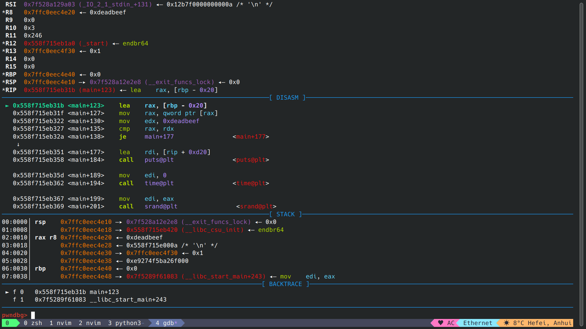
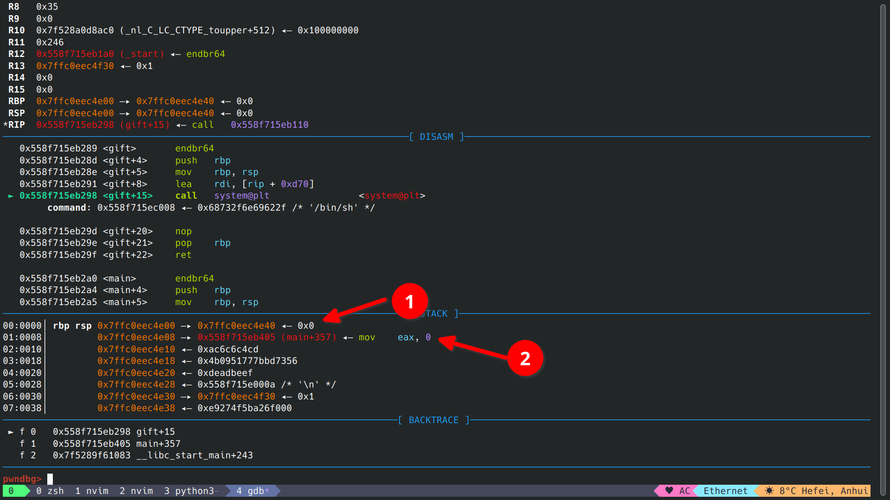

# 1.2.2 gdb 和 pwndbg

>   调试是做题中非常重要的环节，gdb + pwndbg 的组合使用可以给我们做题带来很多便利。

这里也给出 pwndbg 的官方文档：[https://browserpwndbg.readthedocs.io/en/docs/](https://browserpwndbg.readthedocs.io/en/docs/) 和 github 仓库：[https://github.com/pwndbg/pwndbg](https://github.com/pwndbg/pwndbg)

##  pwndbg 安装

在此之前请确保环境中有 `GDB >= 8.1`，然后直接运行以下命令：

```sh
git clone https://github.com/pwndbg/pwndbg
cd pwndbg
./setup.sh
```

---

## pwndbg + gdb 的简单使用

这里先列举几个常用命令并解释其含义，后面会结合上一节的例题 chp0-0 来进一步熟悉部分命令的用法：

| `命令 <参数> [可选参数]` | 简单解释 |
| -- | -- |
| `attach <pid>` | 用 gdb 调试该进程，其中 `<pid>` 指该进程号 |
| `stack [length]` | 查看栈上数据 |
| `telescope <addr>` | 查看目标地址附近数据 |
| `vmmap [addr]` | 查看程序虚拟地址映射情况 |
| `b [addr]` | 下断点 |
| `i <args>` | 获取 info，如 `i b` 可以查看断点信息 |
| `d [bp_id]` | 删除断点 |
| `c` | 继续运行到断点 |
| `ni` | 往下运行一步（不进入函数） |
| `si` | 往下运行一步（进入函数） |
| `finish` | 运行至函数结束 |
| `disassemble [func_name/addr]` | 查看汇编代码 |
| `set <var_name/addr> <value>` | 修改寄存器/内存数值 |
| `<ctrl-c>` | 直接断下运行，gdb 命令行接管控制权 |
| `heap [addr]` | 查看堆 |
| `bins` | 查看 bins |
| `p <addr/name>` | 打印信息，也可跟表达式用作简单计算器 |
| `distance <addr1> <addr2>` | 获得地址偏移 |
| `x/32xg <addr>` | x 即 examine，检查目标地址；32为长度；xg 指 16 进制 64 位显示 |

### 例题 chp0-0-hellopwntools

上面命令不必死记硬背，可具体用到时再使用 `help <command>` 了解目标命令的具体用法及参数含义，下面看一下常规调试流程：

#### 写在调试前

在 python 脚本中，pwntools 给调试也提供了接口，~~不过笔者的电脑屏幕太小了，不习惯分屏操作~~ 还是倾向于另开一个窗口使用 `gdb attach <pid>` 来进行调试。

在脚本想要调试的地方加上：

```python
print(p.pid)    #   pwntools 提供的进程 pid
input()         #   用 input 把程序停下来等待 attach
```

#### 简单调试

在 `gdb attach <pid>` 后，应该看到类似如下界面：


<center style="font-size:14px;color:#C0C0C0;text-decoration:underline">图1 gdb + pwndbg 界面</center>

将 gdb attach 上去之后，可以看到现在断在 read 函数中，而我们的调试目标是 ~~存在漏洞~~ 的 main 函数，因此先连续执行几次 `finish` 指令回到 main 函数中：



<center style="font-size:14px;color:#C0C0C0;text-decoration:underline">图2 回到 main 函数</center>

可以观察汇编代码发现，现在断在 main 函数获取了第一个输入后，现在观察发现我们输入的内容被放在了栈上 `rbp - 0x20` 的地方，内容符合我们构造的 `0xdeadbeef`，读者也可以尝试构造不同的输入，看看栈上是如何存储这些不同形式的数据的。

接下来使用几次 `ni`，由于构造的输入满足题目要求，故经过语句 `<main+138>  je  main+177` 进入下面的环节，同样可以看到 scanf 函数往局部变量里读的数据也储存在栈上。

由于这里有一个循环，而现在已经验证循环中没有问题，所以想跳过循环，考虑如下命令：

```sh
# 先观察汇编代码，考虑循环后面适合断点的代码
disassemble *main
# 最后决定断在 gift 函数前
b *(main+352)
# 直接运行到断点处
c
# 由于 gift 函数没有参数，所以这里寄存器上的值都不重要
si
```

经过上述命令进入了 gift 函数中，这个函数很简单，所以可以看一下函数内部对栈帧与寄存器的使用：

关于函数调用约定详见 [https://learn.microsoft.com/zh-cn/cpp/build/x64-calling-convention](https://learn.microsoft.com/zh-cn/cpp/build/x64-calling-convention?view=msvc-170)

```sh
0x558f715eb289 <gift>       endbr64 
# 保存 old rbp（即保存旧的栈帧）
0x558f715eb28d <gift+4>     push   rbp
# 抬高栈
0x558f715eb28e <gift+5>     mov    rbp, rsp

# 此时函数参数顺序为 rdi, rsi, rdx, rcx, r8, r9, 栈
# 对于这里只有一个参数的 system 函数，把参数放在 rdi 中
0x558f715eb291 <gift+8>     lea    rdi, [rip + 0xd70]
0x558f715eb298 <gift+15>    call   system@plt                <system@plt>

0x558f715eb29d <gift+20>    nop    
# 函数 ret 前还要恢复之前的栈
0x558f715eb29e <gift+21>    pop    rbp
0x558f715eb29f <gift+22>    ret    
```



<center style="font-size:14px;color:#C0C0C0;text-decoration:underline">图3 观察函数运行栈</center>

>   思考：上面的的例子中，发现函数的调用是基于栈和寄存器的，那上图 1 和 2 分别是什么数据，如果 2 被恶意篡改了会发生什么？

---

这一节通过简单的例子介绍了 gdb 的使用和函数的调用约定，在后面的 pwn 旅程中读者会对本节的内容有更深的理解。

