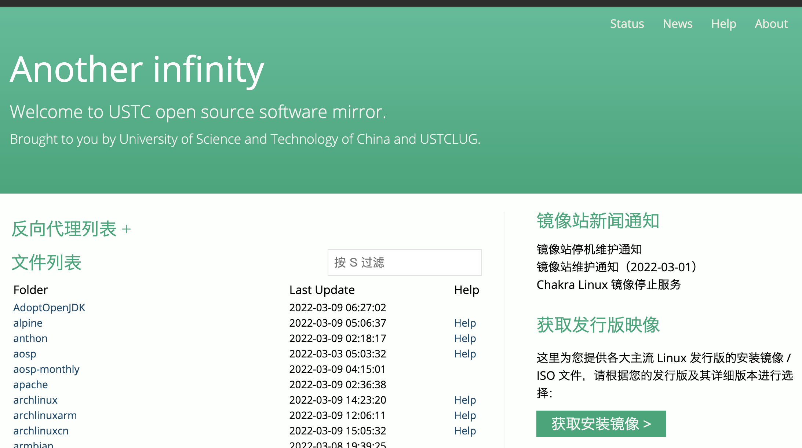
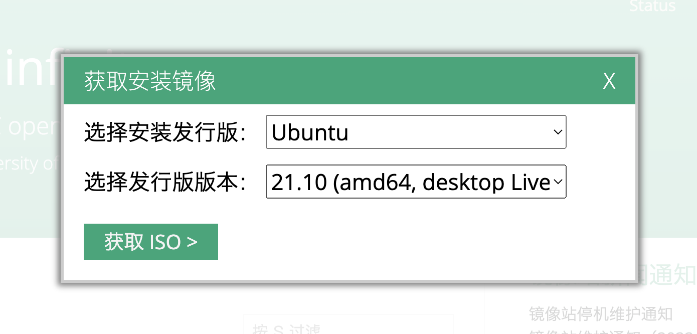

# linux工具使用专题

> **Linux**是一种[自由和开放源码](https://zh.wikipedia.org/wiki/自由及开放源代码软件)的[类UNIX](https://zh.wikipedia.org/wiki/类Unix系统)[操作系统](https://zh.wikipedia.org/wiki/作業系統)。该操作系统的[内核](https://zh.wikipedia.org/wiki/内核)由[林纳斯·托瓦兹](https://zh.wikipedia.org/wiki/林纳斯·托瓦兹)在1991年10月5日首次发布[[5\]](https://zh.wikipedia.org/wiki/Linux#cite_note-5)[[6\]](https://zh.wikipedia.org/wiki/Linux#cite_note-6)，在加上[用户空间](https://zh.wikipedia.org/wiki/使用者空間)的[应用程序](https://zh.wikipedia.org/wiki/應用程式)之后，成为Linux操作系统。Linux也是[自由软件](https://zh.wikipedia.org/wiki/自由软件)和[开放源代码软件](https://zh.wikipedia.org/wiki/开放源代码软件)发展中最著名的例子。只要遵循[GNU 通用公共许可证](https://zh.wikipedia.org/wiki/GNU通用公共许可证)（GPL），任何个人和机构都可以自由地使用Linux的所有底层[源代码](https://zh.wikipedia.org/wiki/源代码)，也可以自由地修改和再发布。大多数Linux系统还包括像提供[GUI](https://zh.wikipedia.org/wiki/GUI)的[X Window](https://zh.wikipedia.org/wiki/X_Window)之类的程序。除了一部分专家之外，大多数人都是直接使用[Linux 发行版](https://zh.wikipedia.org/wiki/Linux發行版)，而不是自己选择每一样组件或自行设置。
>
> --节选自中文维基

linux是信息安全方向中常用的操作系统，这里希望大家能掌握一些工具的使用。

# 系统下载和安装

一般来说，初学者常用的linux发行版都是ubuntu，自本文写下之日已经发布到了21.10版本。大家可以去学校的镜像站(https://mirrors.ustc.edu.cn/)自行下载安装。



右下角选择获取安装镜像。



选择发行版和版本下载。

下载下来的iso文件，可以在实机上安装，也可以通过虚拟机安装。这里建议选择后一种方式。常用的虚拟机有开源的VirtualBox以及商业的Vmware等，在macos下可以使用ParallelsDesktop。这里不详细说明使用方法。

# 系统工具

以下都是一些比较基础的linux命令行常用工具，希望熟练使用。

## 基本概念

### 目录结构

一般地，在linux文件目录中，我们以`/`符号来作为分隔，`.`符号来表示当前目录，`..`来表示上级目录。

同时，单独一个`/`可以表示根目录。

例如，我们要表示根目录下的`usr`文件夹中的`lib`文件夹，就表示成`/usr/lib`。

另外，还有一个特殊的目录，也就是用户的主文件夹，linux中用`~`波浪线来表示。它代表的是`/home/用户名`这个文件夹。

同时，文件夹可以用相对路径来表示。例如，我们现在在`~`下，想要用相对路径定位到`/usr/lib`，可以写成`../../usr/lib`，表示向上两层回到根目录再进入相应文件夹。

## 终端（Terminal）

这是整个linux命令行的操作核心。一般linux系统会提供一个shell程序来方便用户进行系统功能的调用、程序的运行等等。一般地，大部分发行版中自带最基础的为`/bin/sh`，ubuntu中默认使用bash，目录也在`/bin`下。常用的还有zsh等，大家在学习后可以自行配置使用。这里同时提示，一般在`/bin`目录下的二进制文件名都能作为命令来使用。

我们可以在ubuntu的启动台中搜索终端来启动，启动后显示一个命令行窗口，默认目录就在`~`下。


## 常用命令

### `ls`

打印目录下的文件列表。同时可以添加一些参数，最常用的是`ls -l`，可以列出文件的相关信息，另外`ll`是一个基于`ls`的软链接命令，可以打印出隐藏的文件。

```sh
xieq@xieq:~$ ls -l
total 5456
-rw-rw-r--  1 xieq xieq      99 11月 17 17:34 a.txt
-rw-r--r--  1 xieq xieq 1485733 3月   7 14:22 bg.jpg
-rw-rw-r--  1 xieq xieq   16854 3月   2 16:03 bpf.h
-rw-r--r--  1 xieq xieq 3465183 10月 29 17:19 clash-linux-amd64-v1.7.1.gz
drwxrwxr-x  2 xieq xieq    4096 11月 13 20:10 cs
drwxrwxr-x  4 xieq xieq    4096 3月   7 13:21 cve
drwxr-xr-x  2 xieq xieq    4096 3月   7 13:26 Desktop
drwxr-xr-x  2 xieq xieq    4096 10月 29 17:09 Documents
drwxr-xr-x  2 xieq xieq    4096 11月  4 15:40 Downloads
-rw-rw-r--  1 xieq xieq     108 12月 24 18:54 ept
-rw-rw-r--  1 xieq xieq    6659 3月   2 16:03 exploit.c
-rwxr-xr-x  1 xieq xieq  530283 11月 13 20:14 hldsupdatetool.bin
-rw-rw-r--  1 xieq xieq     184 3月   2 16:03 Makefile
drwxrwxr-x  3 xieq xieq    4096 12月 14 16:14 mfem
drwxr-xr-x  2 xieq xieq    4096 10月 29 17:09 Music
drwxr-xr-x  3 xieq xieq    4096 3月   7 14:22 Pictures
drwxr-xr-x  2 xieq xieq    4096 10月 29 17:09 Public
drwxrwxr-x 15 xieq xieq    4096 3月   3 18:57 pwn
drwxrwxr-x  9 xieq xieq    4096 10月 29 21:14 pwndbg
drwxr-xr-x  2 xieq xieq    4096 10月 29 17:09 Templates
drwxrwxr-x  2 xieq xieq    4096 11月 10 20:23 test
-rw-rw-r--  1 xieq xieq     718 12月 14 16:21 Untitled-1.c
drwxr-xr-x  2 xieq xieq    4096 10月 29 17:09 Videos
```

这里介绍一下文件前面的一串十个字符。第一个表示文件类型，横杠代表普通文件，d表示文件夹。后面的九个字符分三组，分别表示文件拥有者、所属群组、其他用户对这个文件的权限，横杠代表没有这项权限。权限分别为读（r，read）、写（w，write），执行（x，excute）。例如上面`-rwxr-xr-x`表示普通文件，其属主可以读写执行，属主的组用户可以读和执行，其他用户可以读和执行。

另外，文件权限可以用三位数来表示，即将rwx由高到低看成三位二进制，有权限为1，无权限为0。上面的`-rwxr-xr-x`的后九位用这种方式表示为755。

### `pwd`

显示当前路径。

```sh
xieq@xieq:~$ pwd
/home/xieq
```

### `cd`

改变当前操作目录。可以使用相对路径或者绝对路径。

```sh
xieq@xieq:~$ cd ..
xieq@xieq:/home$ cd /bin
xieq@xieq:/bin$ 
```

### `cat`

将文件以ascii码方式输出到屏幕。常用于打印文本文件，比如代码等。

```sh
xieq@xieq:~$ cat Makefile
EXPS := exploit
CFLAGS := -Wall -static

all: $(EXPS)

hirsute: CFLAGS += -DUBUNTU_5_11_0_16_17
hirsute: all

$(EXPS): % : %.c bpf.h
	@gcc $@.c $(CFLAGS) -o $@

clean:
	@rm -f $(EXPS)
```

### `cp`、`mv`

拷贝和移动文件，第一个参数为源文件，第二个参数为目标目录或者文件名。

如果要移动整个文件夹，记得加上`-r`参数。

### `rm`

删除文件，后面接文件名。如果要删除文件夹，记得加上`-r`参数。同时为了删除多文件时不用一一确认，可以加上`-f`参数。

### `echo`

输出一行字符。

```sh
xieq@xieq:~$ echo hello world
hello world
```

echo有`-e`参数，表示对字符串中斜杠字符的转义，基本同c语言。

```sh
xieq@xieq:~$ echo -e "\nhello\tworld\n"

hello	world

```

### 正则匹配的使用

终端中支持正则表达式来匹配文件，用来对所有满足表达式的文件进行操作。

一个经典的例子**（千万不要尝试）**为：

```sh
rm -rf /*
```

表示强制递归删除文件和文件夹，目标为`/*`，这将匹配根目录下所有内容。这条命令会删除系统所有文件，曾经有许多人在各大论坛上向新手科普，这一行为近年来正被禁止。

### 输入输出重定向

有些命令需要从键盘读入数据，我们可以转变成从文件输入。

```
wc < a.txt
```

表示从a.txt输入，输入给wc指令（代替键盘输入）。这个指令是用来统计字符的。

但也有更简单的办法，也就是

```sh
wc a.txt
```

有时候，我们希望将输出到屏幕的内容输出到文件里，例如，我们要创建一个文件，里面写入一些字符：

```sh
xieq@xieq:~$ echo helloworld > hw.txt
xieq@xieq:~$ cat hw.txt
helloworld
```

注意，这里的写入是覆盖的，会将已经存在的文件清空。

也可以追加写入。

```sh
xieq@xieq:~$ echo helloworld2 >> hw.txt
xieq@xieq:~$ cat hw.txt
helloworld
helloworld2
```

### 管道符号`|`

有时我们希望一个程序的输出变成另一个程序的输入，例如我们在当前目录下搜索含有某字符串的文件，常用grep指令。

用ls指令列出文件：

```sh
xieq@xieq:~/tmp$ ls -l
total 0
-rw-rw-r-- 1 xieq xieq 0 3月   9 17:00 aaa
-rw-rw-r-- 1 xieq xieq 0 3月   9 17:01 aaa2
-rw-rw-r-- 1 xieq xieq 0 3月   9 17:01 aaa3
-rw-rw-r-- 1 xieq xieq 0 3月   9 17:01 bbb
-rw-rw-r-- 1 xieq xieq 0 3月   9 17:01 ccc
```

我们可以将这个结果作为下一步grep的输入。例如，在结果中搜索含有字符a的行：

```sh
xieq@xieq:~/tmp$ ls -l | grep a
total 0
-rw-rw-r-- 1 xieq xieq 0 3月   9 17:00 aaa
-rw-rw-r-- 1 xieq xieq 0 3月   9 17:01 aaa2
-rw-rw-r-- 1 xieq xieq 0 3月   9 17:01 aaa3
```

注意，这是两条独立的指令的拼接，并没有什么上下文的联系，后面的指令仅仅解析前文指令输出的字符，比如第一行的total因含有字母a，也被筛选了出来。

管道符号可以多级拼接，例如我们想在上面的结果总筛选含有字符串a2的结果，则再拼一层grep。

```sh
xieq@xieq:~/tmp$ ls -l | grep a | grep a2
-rw-rw-r-- 1 xieq xieq 0 3月   9 17:01 aaa2
```

这里提示，grep的一些参数设置可以支持正则匹配，大家可以自行学习。

### 运行一个程序

习惯上地，要切到文件所在的目录下，在文件前加上一个`./`。

### `sudo`

加在指令前，表示用高级权限运行某指令。需要输入密码，运行一次后几分钟内不用重输。

## 命令行软件

### apt

apt是ubuntu下的软件源安装工具，常用来安转一些发布的软件。装机后第一次往往要运行：

```sh
sudo apt update
```

来更新软件源。

```sh
sudo apt install 软件包名
```

来安装一些发行软件。

### vim

一个轻量的文本编辑器。有关vim的教程很多，这里只给一张图。


### ifconfig

查看网卡设备信息，常用来查本机ip。

```sh
xieq@xieq:~/tmp$ ifconfig
docker0: flags=4099<UP,BROADCAST,MULTICAST>  mtu 1500
        ether 02:42:dc:c4:89:34  txqueuelen 0  (Ethernet)
        RX packets 0  bytes 0 (0.0 B)
        RX errors 0  dropped 0  overruns 0  frame 0
        TX packets 0  bytes 0 (0.0 B)
        TX errors 0  dropped 0 overruns 0  carrier 0  collisions 0

enp0s5: flags=4163<UP,BROADCAST,RUNNING,MULTICAST>  mtu 1500
        inet 10.211.55.27  netmask 255.255.255.0  broadcast 10.211.55.255
        inet6 fdb2:2c26:f4e4:0:9f05:af21:c444:e7dc  prefixlen 64  scopeid 0x0<global>
        inet6 fdb2:2c26:f4e4:0:3f51:5c8b:1019:1b54  prefixlen 64  scopeid 0x0<global>
        inet6 fe80::3970:9de3:fc50:1726  prefixlen 64  scopeid 0x20<link>
        ether 00:1c:42:59:13:81  txqueuelen 1000  (Ethernet)
        RX packets 501145  bytes 743757151 (743.7 MB)
        RX errors 0  dropped 0  overruns 0  frame 0
        TX packets 134662  bytes 7793403 (7.7 MB)
        TX errors 0  dropped 0 overruns 0  carrier 0  collisions 0

lo: flags=73<UP,LOOPBACK,RUNNING>  mtu 65536
        inet 127.0.0.1  netmask 255.0.0.0
        inet6 ::1  prefixlen 128  scopeid 0x10<host>
        loop  txqueuelen 1000  (Local Loopback)
        RX packets 9102  bytes 820036 (820.0 KB)
        RX errors 0  dropped 0  overruns 0  frame 0
        TX packets 9102  bytes 820036 (820.0 KB)
        TX errors 0  dropped 0 overruns 0  carrier 0  collisions 0
```

上图中本机ip为第二项的第二行10.211.55.27

### wget、curl

访问url，其中wget常用来下载、curl常用来构造url请求。

```sh
xieq@xieq:~/tmp$ wget www.baidu.com
--2022-03-09 17:18:24--  http://www.baidu.com/
Resolving www.baidu.com (www.baidu.com)... 180.101.49.12, 180.101.49.11
Connecting to www.baidu.com (www.baidu.com)|180.101.49.12|:80... connected.
HTTP request sent, awaiting response... 200 OK
Length: 2381 (2.3K) [text/html]
Saving to: ‘index.html’

index.html                 100%[======================================>]   2.33K  --.-KB/s    in 0s      

2022-03-09 17:18:24 (261 MB/s) - ‘index.html’ saved [2381/2381]

xieq@xieq:~/tmp$ curl www.baidu.com > index.html
  % Total    % Received % Xferd  Average Speed   Time    Time     Time  Current
                                 Dload  Upload   Total   Spent    Left  Speed
100  2381  100  2381    0     0  25602      0 --:--:-- --:--:-- --:--:-- 25602
```

curl加上重定向后和wget功能基本相同。

### ssh

访问远程计算机上的shell。需要用户名和密码，且服务器上运行了openssh。常常用来连接服务器。

```sh
ssh 用户名@服务器地址 [-P 端口号(默认22)]
```

